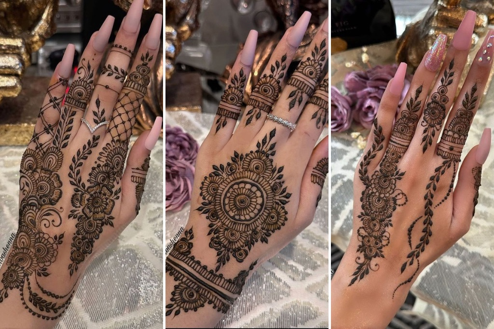

# Introduction

Henna is a huge part of my culture and is a natural dye that has been used for centuries across many cultures for art, celebration, and symbolism in religious and cultural settings.

## What Plant does Henna Come?
Henna comes from the leaves of the *Lawsonia inermis* plant. This is a plant that has been used in mnay regions including South Asia, the Middle East, and North Africa.

Henna is **deeply symbolic**, and it can be associated with *history, art, and tradition*.

### Common Uses of Henna

- Weddings
- Religious celebrations
- Festivals
- Personal expression/ artistic display

### Why Henna Matters To Me

1. It allows my to boldly display my cultural identity.
2. It connects me to my family and the woman in my family as a bonding activity.
3. It allows for varaition in style, shapes, and colors. 

This is a bit about the history of henna:
[History of Henna](https://www.nhm.ac.uk/discover/the-henna-plant-transcending-time-religion-and-culture.html)

 `Lawsonia inermis`



```{r}
#| echo: true
#Estimated cost of henna cone!
henna_powder <- 2.50
essential_oils <- 1.75
sugar_lemon <- 0.75
cellophane_cone <- 0.50
labor_time <- 0.5
hourly_rate <- 20.00

total_cost <- henna_powder + essential_oils + sugar_lemon + cellophane_cone + (labor_time * hourly_rate)
sprintf("$%.2f", total_cost)
```
